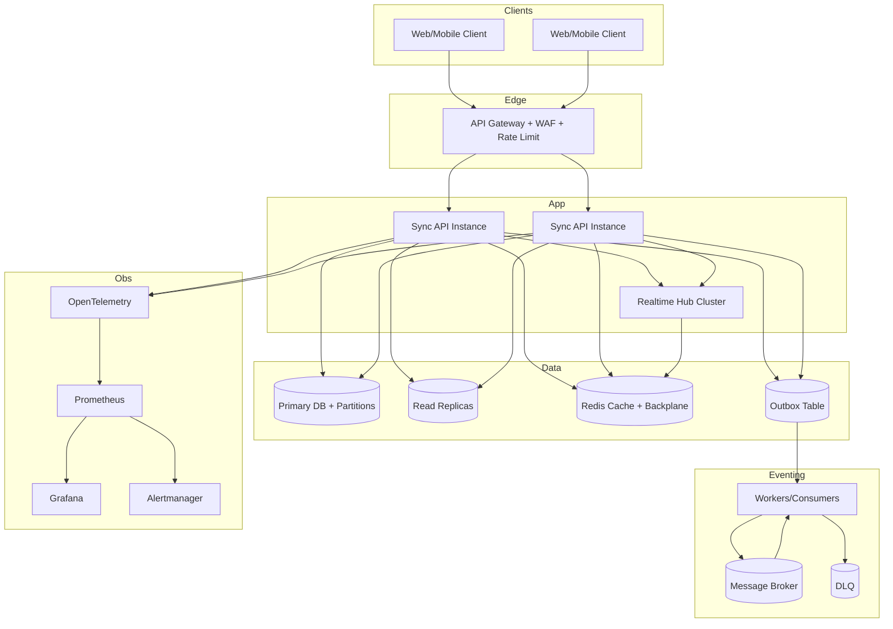
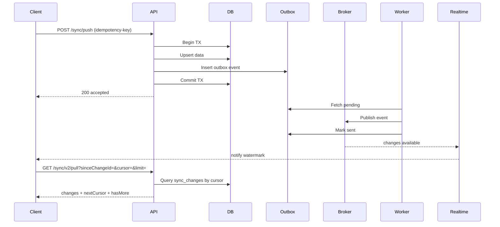

# Backend Upgrade Blueprint (Production-Scale Sync Platform)

> Mục tiêu tài liệu: mô tả lộ trình chuyển đổi backend hiện tại lên mức kiến trúc service production-scale (distributed, observable, fault-tolerant).

---

## 1) Executive Summary

Backend hiện tại phù hợp demo/POC và tải nhỏ, nhưng chưa đủ để chịu tải rất lớn do các giới hạn cốt lõi:

- State còn phụ thuộc in-memory + file snapshot.
- Chưa có distributed event pipeline bền vững.
- Realtime chưa có scale-out backplane chuẩn.
- Chưa có nền tảng observability/rate-limit/retry/DR đầy đủ.

Để lên mức production-scale, cần chuyển đổi theo 3 trục:

1. **Data plane**: DB chuẩn + partition + read model.
2. **Event plane**: outbox + broker + consumer idempotent + DLQ.
3. **Ops plane**: autoscale + telemetry + resiliency + rollout control.

---

## 2) Mục tiêu kỹ thuật cuối cùng

- Hỗ trợ scale ngang nhiều node backend.
- Không mất dữ liệu/event khi restart hoặc lỗi mạng.
- Pull delta nhanh theo cursor/watermark, không full-scan.
- Realtime fan-out ổn định khi scale-out.
- Có khả năng vận hành 24/7: quan sát, cảnh báo, replay, rollback.

---

## 3) Gap hiện tại (và vì sao phải đổi)

## 3.1 State management
**Hiện tại:** in-memory dictionary + file snapshot.  
**Rủi ro:** restart/multi-node gây lệch state; không phù hợp horizontal scaling.

## 3.2 Sync transport
**Hiện tại:** HTTP pull/push cơ bản, realtime đơn tuyến.  
**Rủi ro:** tăng tải dễ nghẽn; broadcast không ổn khi nhiều instance.

## 3.3 Event durability
**Hiện tại:** chưa có outbox/broker chuẩn.  
**Rủi ro:** có thể mất event hoặc mismatch trạng thái khi lỗi giữa DB và publish.

## 3.4 Observability
**Hiện tại:** chưa đủ metrics/tracing/alert theo chuẩn SRE.  
**Rủi ro:** lỗi âm thầm, phát hiện muộn, khó RCA.

---

## 4) Kiến trúc mục tiêu



---

## 5) Lộ trình chuyển đổi chi tiết

## Phase 0 — Foundation (2-4 tuần)

### 5.0.1 Chuẩn hóa contract sync v2
- Chuẩn `ChangeEnvelope`, `serverWatermark`, `nextCursor`, `hasMore`.
- Version endpoint rõ ràng (`/v1`, `/v2`).

### 5.0.2 Bổ sung metadata cần thiết
- `tenantId`, `replicaId`, `eventId`, `idempotencyKey`, `traceId`.

### 5.0.3 Đặt telemetry baseline
- Structured logging + trace context + request correlation id.

**Deliverables**
- API contract doc.
- Dashboard baseline (latency/error/qps).

---

## Phase 1 — Data Plane hardening (4-8 tuần)

### 5.1.1 Chuyển state sang DB
- Bỏ phụ thuộc runtime dictionary/file cho nguồn sự thật.
- Tạo bảng chính: `todos`, `sync_changes`, `replica_state`.

### 5.1.2 Partition + index
- Partition theo tenant/hash key.
- Index cho pull delta:
  - `(tenant_id, change_id)`
  - `(tenant_id, updated_at)`

### 5.1.3 Read model / read replica
- Pull endpoint ưu tiên đọc read replica/materialized projection.

**Code mẫu (EF Core skeleton):**

```csharp
public class SyncChange
{
    public long ChangeId { get; set; }
    public string TenantId { get; set; } = default!;
    public string EntityType { get; set; } = "todo";
    public string EntityId { get; set; } = default!;
    public string Op { get; set; } = default!;
    public string PayloadJson { get; set; } = default!;
    public long CreatedAt { get; set; }
}

protected override void OnModelCreating(ModelBuilder b)
{
    b.Entity<SyncChange>().HasKey(x => x.ChangeId);
    b.Entity<SyncChange>().HasIndex(x => new { x.TenantId, x.ChangeId });
    b.Entity<SyncChange>().HasIndex(x => new { x.TenantId, x.CreatedAt });
}
```

**Trade-off**
- Tăng chi phí migration + quản trị DB.

**Lợi ích**
- Scale ngang, bền dữ liệu, query delta nhanh và ổn định.

---

## Phase 2 — Event Plane hardening (4-8 tuần)

### 5.2.1 Transactional Outbox
- Ghi business data + outbox cùng transaction.
- Publisher worker đọc outbox và publish broker.

### 5.2.2 Broker + consumer idempotent
- Dùng broker chuẩn (Kafka/Rabbit/NATS tùy hạ tầng).
- Consumer bắt buộc idempotent theo `eventId`.

### 5.2.3 Retry + DLQ + replay
- Retry backoff.
- Dead-letter queue cho poison message.
- Công cụ replay có kiểm soát.

**Code mẫu outbox worker:**

```csharp
public async Task PublishLoop(CancellationToken ct)
{
    while (!ct.IsCancellationRequested)
    {
        var batch = await _outbox.FetchPendingAsync(500, ct);
        foreach (var evt in batch)
        {
            try
            {
                await _broker.PublishAsync(evt.Topic, evt.Key, evt.Payload, ct);
                await _outbox.MarkSentAsync(evt.Id, ct);
            }
            catch
            {
                await _outbox.MarkRetryAsync(evt.Id, ct);
            }
        }

        await Task.Delay(200, ct);
    }
}
```

**Trade-off**
- Thêm complexity vận hành broker + DLQ.

**Lợi ích**
- Không mất event, recover được sau sự cố, nhất quán tốt hơn.

---

## Phase 3 — Realtime + Scale-out (3-6 tuần)

### 5.3.1 Realtime backplane
- Scale SignalR/realtime hub qua Redis backplane hoặc gateway push chuyên dụng.

### 5.3.2 Presence/channel partitioning
- Channel theo tenant/shard để giảm fan-out vô ích.

### 5.3.3 Connection governance
- Limit per tenant/client.
- Backpressure và drop policy hợp lý.

**Code mẫu SignalR Redis backplane:**

```csharp
builder.Services
    .AddSignalR()
    .AddStackExchangeRedis(redisConnectionString, options =>
    {
        options.Configuration.ChannelPrefix = "sync";
    });
```

**Trade-off**
- Tăng chi phí Redis cluster + tuning.

**Lợi ích**
- Broadcast ổn định khi nhiều instance chạy song song.

---

## Phase 4 — Reliability & Protection (3-5 tuần)

### 5.4.1 Rate limit / quota
- Theo IP/user/tenant để chống burst.

### 5.4.2 Circuit breaker + timeout + retry policy
- Với downstream dependencies.

### 5.4.3 Idempotency API
- Header `Idempotency-Key` cho push/write.

**Code mẫu rate limit:**

```csharp
builder.Services.AddRateLimiter(options =>
{
    options.AddFixedWindowLimiter("sync-write", limiter =>
    {
        limiter.PermitLimit = 100;
        limiter.Window = TimeSpan.FromSeconds(10);
        limiter.QueueLimit = 500;
    });
});

app.UseRateLimiter();
```

**Trade-off**
- Có thể từ chối request hợp lệ lúc burst.

**Lợi ích**
- Bảo vệ cluster, tránh domino failure.

---

## Phase 5 — Observability/SRE (song song mọi phase)

### 5.5.1 Metrics bắt buộc
- API p50/p95/p99 latency
- error rate
- QPS
- broker lag
- outbox backlog
- realtime connections by tenant
- DB pool saturation

### 5.5.2 Tracing
- OpenTelemetry trace từ API -> DB -> broker -> worker.

### 5.5.3 Alert & runbook
- Alert rõ ngưỡng + playbook xử lý.

**Trade-off**
- Tốn effort vận hành và discipline.

**Lợi ích**
- Phát hiện sớm, MTTR thấp hơn rõ rệt.

---

## 6) Sequence luồng sync chuẩn đề xuất



---

## 7) Kế hoạch capacity cho mục tiêu cực lớn

> Quan trọng: con số user lớn không đồng nghĩa concurrent lớn cùng lúc. Cần capacity theo active concurrent + workload profile.

### 7.1 Capacity modeling bắt buộc
- DAU/MAU
- concurrent peak
- events/user/day
- read-write ratio
- realtime connection ratio
- p95 SLA mục tiêu

### 7.2 Load testing bắt buộc
- baseline, stress, soak (24h+), chaos
- test từng tier: API, DB, broker, realtime

### 7.3 Rollout chiến lược
- Canary 1-5-20-50-100%
- feature flag theo tenant
- rollback trong phút, không giờ

---

## 8) Trade-off tổng thể (phải chấp nhận)

1. **Complexity tăng mạnh**
   - Nhiều component hơn (DB cluster, broker, cache, workers).
2. **Chi phí tăng**
   - Infra + monitoring + oncall.
3. **Đòi hỏi đội ngũ mạnh hơn**
   - Platform/SRE/DBA/Data engineering phối hợp.
4. **Time-to-market ngắn hạn chậm hơn**
   - Đổi lại độ ổn định dài hạn tăng mạnh.

---

## 9) Lợi ích của các đánh đổi

- Chịu tải cao bền vững, giảm nguy cơ sập dây chuyền.
- Không mất dữ liệu/event khi gặp sự cố.
- Dễ mở rộng region/tenant/domain mới.
- Tăng độ tin cậy vận hành và trải nghiệm user cuối.

---

## 10) Checklist nghiệm thu từng phase

- [ ] Không còn source-of-truth nằm trong process memory.
- [ ] Sync v2 cursor chạy ổn với 10k/100k records test.
- [ ] Outbox + broker + DLQ + replay chạy thực chiến.
- [ ] Realtime scale-out qua nhiều instance không miss notify.
- [ ] Có dashboard + alert + runbook + chaos test pass.
- [ ] Canary + rollback verified.

---

## 11) Kết luận

Để lên mức service production-scale thực thụ, cần chuyển từ kiến trúc đơn tiến trình sang kiến trúc distributed theo các phase ở trên. Đây là chuyển đổi lớn nhưng bắt buộc nếu mục tiêu là tăng trưởng rất cao mà vẫn giữ độ ổn định và trải nghiệm người dùng.

