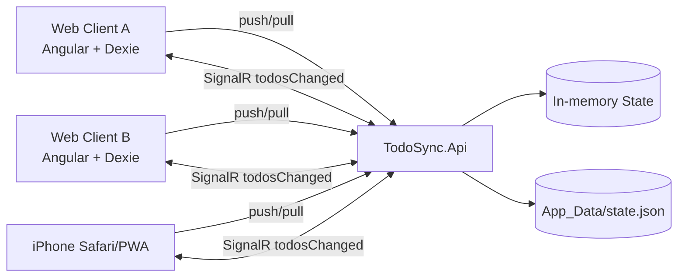
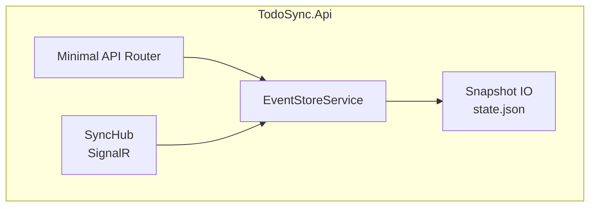
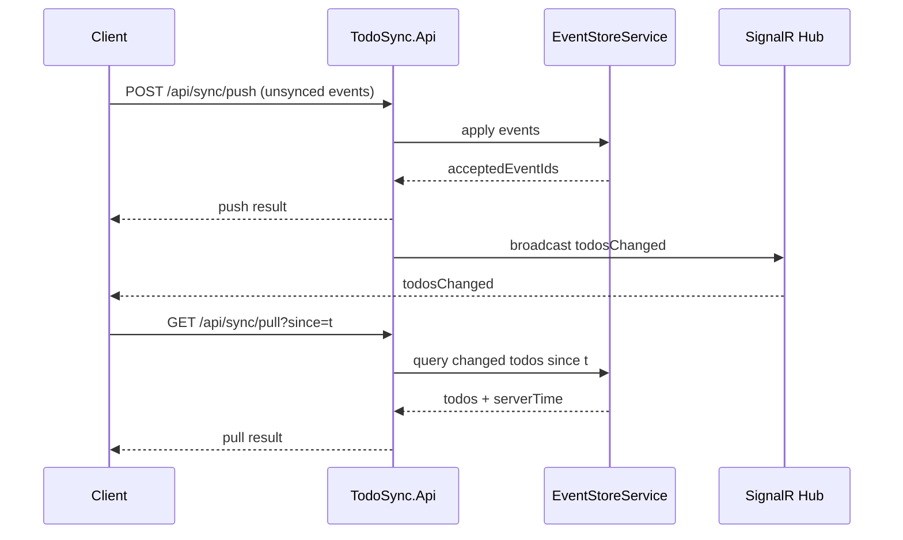
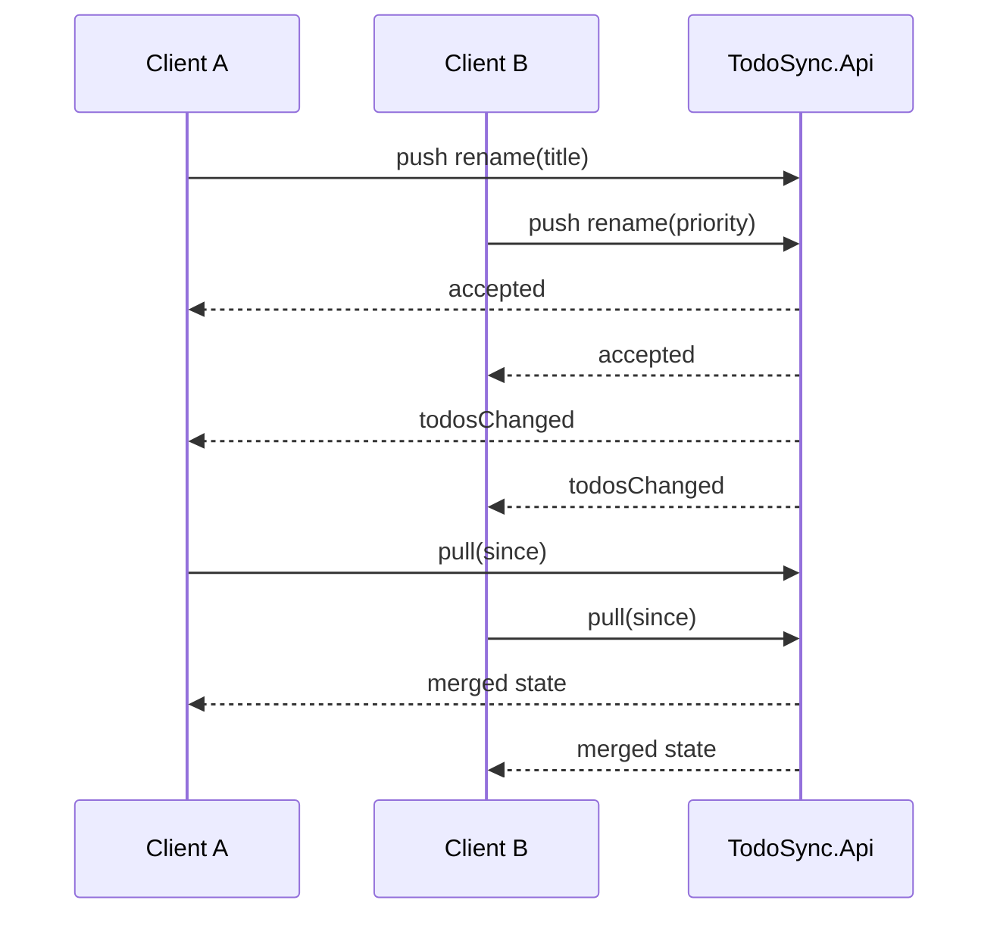
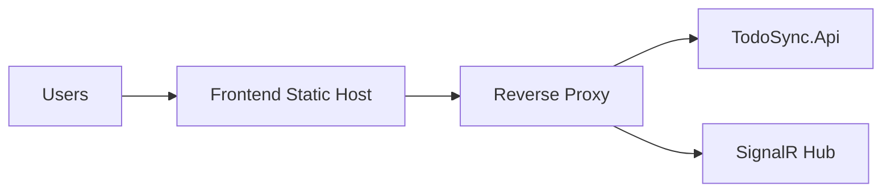

# Todolist Backend — Architecture Guide

Backend sync service cho ứng dụng Todolist theo mô hình **offline-first + event-driven synchronization**.

---

## 1) Architectural Goals

- **Offline-first**: client vẫn thao tác local khi mất mạng.
- **Eventually consistent**: đồng bộ dần giữa nhiều client/tab/device.
- **Conflict-tolerant**: chấp nhận cập nhật bất đồng bộ theo event stream.
- **Realtime awareness**: client nhận tín hiệu thay đổi để sync nền.

---

## 2) Technology Stack

- **Runtime**: .NET 10
- **Web/API**: ASP.NET Core Minimal API
- **Realtime**: SignalR (`/hubs/sync`)
- **Persistence (current)**:
  - In-memory state store
  - Snapshot ra file JSON (`App_Data/state.json`)
- **Serialization**: `System.Text.Json`
- **Transport**: HTTP + WebSocket (SignalR)

---

## 3) High-Level System Context



---

## 4) Container View



**Responsibility split:**
- **Router**: nhận request sync/pull/debug.
- **EventStoreService**: validate/apply event, merge state, tính watermark.
- **SyncHub**: broadcast `todosChanged` sau khi state mutate.
- **Snapshot IO**: lưu/khôi phục state khi process restart.

---

## 5) Core Sync API Contract

- `POST /api/sync/push`
  - Input: danh sách client events chưa sync
  - Output: accepted event ids
- `GET /api/sync/pull?since=<unix-ms>`
  - Output: todos thay đổi từ watermark `since`
  - `serverTime`: watermark mới
- `GET /api/sync/all`
  - Debug endpoint: trả full current server state

---

## 6) Realtime Contract

- Hub: `/hubs/sync`
- Event broadcast: `todosChanged`
- Mục tiêu: **notify** client có thay đổi để tự gọi pull/sync nền

---

## 7) Domain Event Model

Hệ thống hiện xử lý các event chính:

- `TODO_CREATED`
- `TODO_TOGGLED`
- `TODO_RENAMED`
- `TODO_REORDERED`
- `TODO_DELETED`
- `TODO_UPSERTED_FROM_SERVER`

> Gợi ý evolution: tách field-level event (`TITLE_UPDATED`, `PRIORITY_UPDATED`) để merge đồng thời tốt hơn.

---

## 8) Main Sequence — Normal Sync Cycle



---

## 9) Sequence — Concurrent Update (2 clients)



> Lưu ý: nếu event payload mang full object thay vì patch-field, có thể ghi đè lẫn nhau. Nên ưu tiên merge theo field.

---

## 10) Data/State Strategy

- **Authoritative runtime state**: in-memory cho hiệu năng.
- **Durability**: snapshot định kỳ/trigger vào `App_Data/state.json`.
- **Recovery**: startup load snapshot để phục hồi state.

Trade-off hiện tại:
- Ưu: đơn giản, nhanh setup dev/staging.
- Nhược: chưa phù hợp HA/horizontal scale (single-node memory centric).

---

## 11) Deployment Topology (Recommended)



- Frontend gọi same-origin:
  - `/api/sync/*`
  - `/hubs/sync`
- TLS termination ở reverse proxy.
- Bật sticky/session phù hợp cho SignalR nếu scale-out.

---

## 12) Local Run

Yêu cầu:
- .NET SDK 10

Chạy:

```bash
cd TodoSync.Api
dotnet run
```

Mặc định:
- `http://localhost:3000`

---

## 13) Evolution Roadmap (Architect level)

- Chuyển storage từ file snapshot sang DB event log (PostgreSQL/SQL Server).
- Bổ sung idempotency key + dedupe cho push events.
- Conflict resolution theo field timestamp/vector metadata.
- Observability: tracing + metrics (sync latency, conflict rate, pull size).
- Multi-node readiness: distributed backplane cho SignalR.

---

## 14) Source Pointers (for implementers)

- API bootstrap/routes: `TodoSync.Api/Program.cs`
- Core sync logic: `TodoSync.Api/Services/EventStoreService.cs`
- Hub realtime: `TodoSync.Api/Hubs/SyncHub.cs`
- Contracts/models: `TodoSync.Api/Models/*`
- Snapshot file: `TodoSync.Api/App_Data/state.json`


